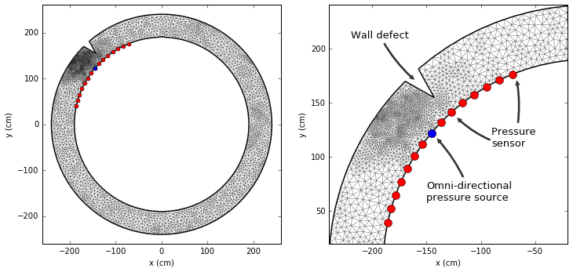

# fem-pipe
FEM simulations on pipe geometries

## Case: 2D acoustic
[source](https://github.com/peberg/fem-pipe/blob/master/pipe_2D_acoustic.ipynb)

## Case: 3D electrostatic
[source](https://github.com/peberg/fem-pipe/blob/master/pipe_2D_acoustic.ipynb)

