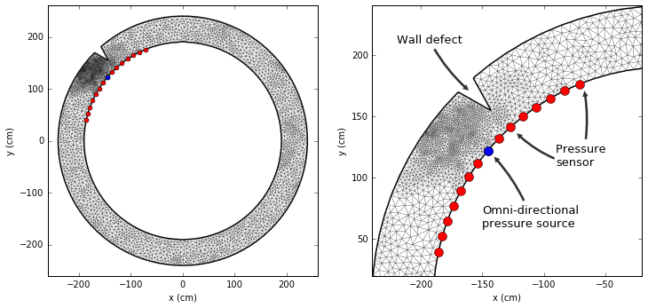
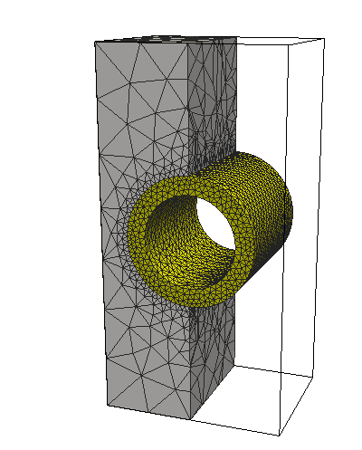
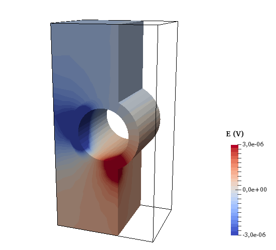

# fem-pipe
FEM simulations on hypothetical pipe geometries
using [PyGimli](http://www.pygimli.org/), [Tetgen](http://wias-berlin.de/software/tetgen/) and [Paraview](http://www.paraview.org/).

## Case: 2D acoustic wave propagation
[source](https://github.com/peberg/fem-pipe/blob/master/pipe_2D_acoustic.ipynb)

2D pipe geometry used for acoustic forward modelling.

Acoustic wave propagation and pressure signals registered at sensor locations.

## Case: 3D electrostatic potential
[source](https://github.com/peberg/fem-pipe/blob/master/pipe_3D_electrostatic2.ipynb)

Mesh             |  Electrical potential
:-------------------------:|:-------------------------:
  |  
