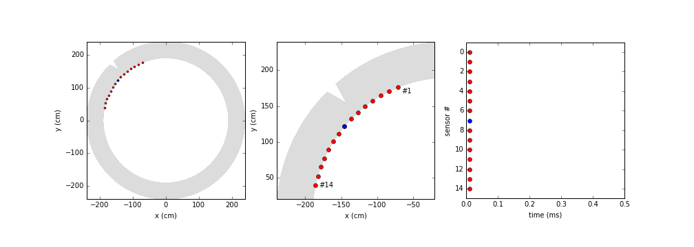

# fem-pipe
FEM simulations on hypothetical pipe geometries.
using [PyGimli](http://www.pygimli.org/)

## Case: 2D acoustic
[source](https://github.com/peberg/fem-pipe/blob/master/pipe_2D_acoustic.ipynb)

2D pipe geometry used for acoustic forward modelling.

Acoustic wave propagation and pressure signals registered at sensor locations.

## Case: 3D electrostatic
[source](https://github.com/peberg/fem-pipe/blob/master/pipe_2D_acoustic.ipynb)

