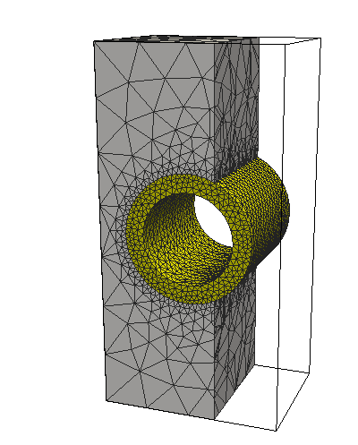

# fem-pipe
FEM simulation examples on hypothetical pipe geometries
using [PyGimli](http://www.pygimli.org/), [Tetgen](http://wias-berlin.de/software/tetgen/) and [Paraview](http://www.paraview.org/). The examples were produced for demonstration purposes only.

## Example 1: 2D acoustic wave propagation
2D pipe geometry used for acoustic forward modelling [[source](https://github.com/peberg/fem-pipe/blob/master/pipe_2D_acoustic.ipynb)].

Acoustic wave propagation and signals registered at sensor locations.

## Example 2: 3D electrostatic potential
Electrostatic potential resulting from electric current in pipeline wall (current electrodes locate towards the nearest model face) [[source](https://github.com/peberg/fem-pipe/blob/master/pipe_3D_electrostatic2.ipynb)].

Mesh             |  Electrostatic potential
:-------------------------:|:-------------------------:
  |  
